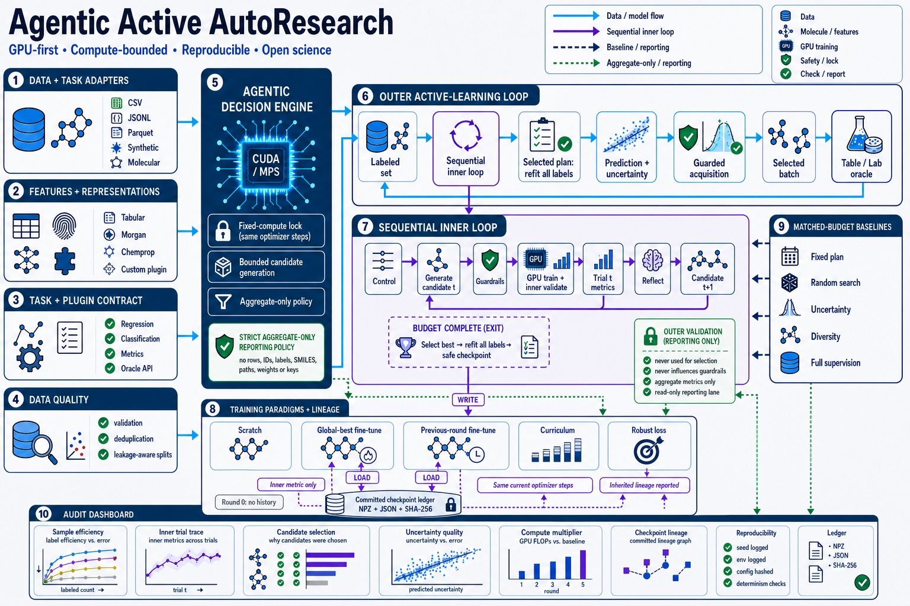
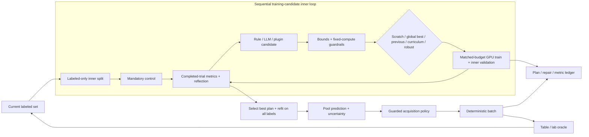

<p align="center">
  
</p>

<h1 align="center">Agentic Active AutoResearch</h1>

<p align="center"><strong>GPU-first active learning where the agent advises, guardrails decide, and every sample is auditable.</strong></p>

<p align="center">
  
  
  
  
</p>

Agentic Active AutoResearch is an open, provider-neutral framework for pool-based active learning in regression,
classification, and molecular-property workflows. Every outer acquisition round contains a real
sequential inner loop: generate bounded training candidates, train and validate them on the
currently labeled set, reflect on completed trials, select the best plan, and refit it before pool
scoring. An optional LLM can advise both candidate generation and acquisition strategy—without
permission to execute code, change compute/label budgets, or see raw dataset rows.

The default formal path uses a PyTorch ensemble with CUDA or Apple MPS and MC Dropout. Chemprop v2
is available for molecular tasks. Random Forest exists only as a CPU baseline and CI smoke test.



[中文说明](README.zh-CN.md) · [Quickstart](docs/quickstart.md) ·
[GPU setup](docs/gpu.md) · [Architecture](docs/architecture.md) · [Security](docs/security.md) ·
[Inner loop](docs/inner-loop.md) · [Support matrix](docs/support-matrix.md) ·
[References](docs/references.md)

## Why this project is different

| Property | What Agentic Active AutoResearch does |
|---|---|
| GPU-first, honestly | Formal configs require CUDA/MPS. CPU fallback is opt-in and labeled as a baseline. |
| Agentic, not opaque | A sequential generator proposes bounded training candidates; a separate policy proposes acquisition weights. Both are validated and logged. |
| Auditable by sample | Each selected row retains prediction, uncertainty, component scores, final score, and observed label. |
| Five real training paths | Scratch, global-best fine-tuning, previous-round fine-tuning, curriculum learning, and robust loss are executable PyTorch candidates, not labels in a diagram. |
| Fair by construction | Batch size, rounds, split, seed, epochs, architecture, ensemble size, and optimizer steps stay outside the LLM's control; inherited checkpoint lineage is reported separately. |
| Provider-neutral | Any OpenAI-compatible chat endpoint can be selected through environment variables. Offline mode is default. |
| Domain-extensible | CSV/JSONL/Parquet/synthetic data plus registered loaders, tabular/Morgan features, regression/classification, custom models, policies, acquisitions, and oracles. Exact limits are explicit in the support matrix. |
| Failure-aware | Invalid JSON, timeouts, unknown components, missing accelerators, changed datasets, and partial oracle results fail safely. |
| Reproducible | Atomic artifacts, config/data hashes, deterministic tie-breaking, device metadata, resume checks, and a standalone HTML report. |

## Nested closed loop



The outer validation split reports performance but never selects a training candidate. This
separation follows the model-selection bias cautions of
[Cawley & Talbot (2010)](https://www.jmlr.org/papers/v11/cawley10a.html). Because adaptive search
uses extra fits, Agentic Active AutoResearch records its compute multiplier and recommends a matched-budget random
search baseline, following [Bergstra & Bengio (2012)](https://www.jmlr.org/papers/v13/bergstra12a.html).

The acquisition policy also receives labeled-only inner metrics rather than outer-validation
metrics. Outer validation is an audit/reporting stream and does not steer candidate generation or
sample acquisition.

The core design follows the pool-based active-learning setting summarized by
[Settles (2009)](https://burrsettles.com/pub/settles.activelearning_20090109.pdf). Molecular
backends build on ideas and tooling from
[Chemprop](https://doi.org/10.1021/acs.jcim.3c01250), while the pool-screening workflow is related
to [MolPAL](https://doi.org/10.1039/D0SC06805E). Agentic behavior is deliberately narrower than
general autonomous-science systems: following the tool-grounding lesson of
[ChemCrow](https://doi.org/10.1038/s42256-024-00832-8), numerical tools remain authoritative and
the language model is advisory.

## Install

```bash
git clone https://github.com/llmir/agentic-active-autoresearch.git
cd agentic-active-autoresearch
python -m venv .venv
source .venv/bin/activate          # Windows: .venv\Scripts\activate
python -m pip install --upgrade pip
python -m pip install -e .
agentic-autoresearch doctor
```

The distribution/repository slug is `agentic-active-autoresearch`, the recommended command is
`agentic-autoresearch`, and the stable Python import remains `agentic_al`. The shorter `agentic-al`
command is retained as a compatibility alias.

For molecular work:

```bash
python -m pip install -e '.[molecule]'
# Or the Chemprop backend:
python -m pip install -e '.[molecule,chemprop]'
# Optional Parquet input:
python -m pip install -e '.[parquet]'
```

PyTorch selects CUDA first, then Apple MPS. A formal config sets
`model.require_accelerator: true`; if neither exists, the run stops instead of silently training
on CPU.

See [GPU setup and troubleshooting](docs/gpu.md) for CUDA/MPS checks and Chemprop notes.

## GPU demo

```bash
agentic-autoresearch demo --output-dir outputs/my-gpu-demo
```

Expected final lines include `"accelerator_used": true` and `"device": "cuda"` or `"mps"`.
Open `outputs/my-gpu-demo/report.html` for the standalone report.

The explicit CPU smoke path is:

```bash
agentic-autoresearch demo --cpu-baseline --output-dir outputs/cpu-smoke
```

Do not use the CPU smoke result as evidence for the formal GPU model.

## Run a configured experiment

```bash
agentic-autoresearch validate-config --config configs/gpu_regression.yaml
agentic-autoresearch run --config configs/gpu_regression.yaml
```

Resume only an unchanged run:

```bash
agentic-autoresearch run --config configs/gpu_regression.yaml --resume
```

Agentic Active AutoResearch checks the redacted-config, dataset, built-in source, and secret-free provider-runtime
fingerprints before resuming. Completed inner trials are reused only when the resolved model, seed,
metric, source, and hashed inner-data contract match.

## Configure training-candidate generation

```yaml
inner_loop:
  enabled: true
  candidate_generator: rule_based  # auto uses the LLM provider when agent.enabled=true
  trial_budget: 6                   # control + five core paradigms when available
  candidates_per_step: 1           # reflect before producing the next candidate
  validation_fraction: 0.25
  selection_metric: mae
  selection_mode: min
  require_control: true
  candidate_paradigms:
    - retrain_from_scratch
    - finetune_global_best
    - finetune_previous_round
    - curriculum_training
    - robust_loss_training
  tunable_parameters:
    learning_rate: [0.00001, 0.005]
    dropout: [0.0, 0.5]
    weight_decay: [0.0, 0.01]
```

`epochs`, batch size, architecture/depth/width, ensemble size, MC passes, workers, and budgets are
not agent-tunable. The built-in PyTorch backend executes scratch retraining, labeled-inner-metric
global-best continuation, previous-round continuation, easy-to-hard curriculum learning, and
same-budget Huber training. Historical checkpoints are current-run, committed, non-pickle,
SHA-256-verified artifacts; round zero omits history-dependent candidates. Unsupported backends
expose only their real capabilities. See the complete [inner-loop contract](docs/inner-loop.md).

## Bring tabular data

```yaml
dataset:
  kind: csv
  path: ../data/my_pool.csv
  task: regression
  id_column: sample_id
  generate_id_if_missing: true
  target_column: activity
  feature_columns: [descriptor_a, descriptor_b, family]
  group_column: series_id       # optional leakage-aware validation split
  cost_column: experiment_cost # optional acquisition penalty
  risk_column: failure_risk    # optional acquisition penalty
```

Set `kind: jsonl` for newline-delimited JSON or `kind: parquet` for Parquet; all built-in formats
share the same schema, leakage, ID, and missing-value checks. Trusted plugins can register loaders
for databases or lab systems with `register_dataset()`. The CLI simulates an oracle by hiding and
revealing the target column. For a genuinely unlabeled regression pool, supply an idempotent
`Oracle` plus a separate labeled `validation_data` DataFrame through the Python API. Fully
unlabeled classification is not claimed in version 0.1.0. See
[custom datasets and oracles](docs/custom-dataset.md).

## Molecular routes

The repository includes two GPU recipes:

- `configs/qm9_torch_gpu.yaml`: Morgan fingerprints → PyTorch MLP ensemble → MC Dropout.
- `configs/qm9_chemprop_gpu.yaml`: SMILES → Chemprop v2 D-MPNN → MC Dropout; Morgan space is used
  only for the diversity component.

Place a licensed QM9-derived CSV at `data/qm9.csv`; do not commit it. The sample configs expect
`smiles` and `lumo`. If `sample_id` is absent, stable row IDs are generated. If you request a
`scaffold` group, Agentic Active AutoResearch derives Bemis–Murcko scaffolds with RDKit so validation can prevent
scaffold leakage; precomputing the column is still recommended for very large files.
Always verify target units before choosing `target_range`; the example range is illustrative, not
a chemistry recommendation.

## Optional LLM policy—no key in YAML

```bash
export AGENTIC_AL_API_BASE='https://your-provider.example/v1'
export AGENTIC_AL_API_KEY='...'
export AGENTIC_AL_MODEL='your-model-id'
agentic-autoresearch run --config configs/openai_compatible_gpu.yaml
```

Only aggregate values leave the process. The acquisition policy receives round/pool summaries;
the training-candidate generator receives bounded parameter names, inner selection metrics, and
remaining trial count. SMILES, feature rows, row IDs, labels, paths, API keys, checkpoints, and raw
model responses are neither sent nor logged. Sanitized proposals and deterministic repairs are
logged. HTTPS is required except for localhost. Any provider failure falls back to the offline
policy when configured.

## Artifact contract

```text
outputs/my-run/
├── config.resolved.yaml    # redacted, secret-free configuration
├── environment.json        # versions + accelerator-independent environment facts
├── manifest.json           # config/data hashes and split sizes
├── observations.csv        # local; excluded from Git by outputs/
├── state.json              # atomic resume checkpoint
├── summary.csv             # one comparable row per completed round
├── final_metrics.json
├── report.html             # self-contained report
└── round_000/
    ├── inner_loop/
    │   ├── inner_loop_config.json
    │   ├── split_summary.json
    │   ├── summary.csv
    │   ├── best_trial.json
    │   └── step_*/
    │       ├── agent_context.json
    │       ├── candidate_batch.json
    │       ├── reflection.json
    │       └── trial_*/{training_plan.json,trial_result.json}
    ├── strategy.json       # acquisition proposal, repairs, weights, fallback status
    ├── metrics.json        # outer evaluation + model/device/inner-loop metadata
    ├── selection.csv       # row-level acquisition provenance
    └── commit.json
```

`outputs/`, `data/`, checkpoints, `.env*`, keys, and local environments are ignored by Git.
Public config artifacts replace local dataset/output locations with placeholders.

## Extend without forking the engine

```python
from agentic_al import register_acquisition


def representativeness(context, config):
    center = context.pool_features.mean(axis=0)
    distance = ((context.pool_features - center) ** 2).sum(axis=1) ** 0.5
    return 1.0 / (1.0 + distance)


register_acquisition("representativeness", representativeness)
```

Load trusted extensions explicitly:

```bash
agentic-autoresearch run --config config.yaml --plugin my_lab.agentic_al_plugin
# Or a reviewed source file from a cloned repository:
agentic-autoresearch run --config config.yaml --plugin examples/custom_training_candidates.py
```

The same registry supports custom sequential candidate generators through
`register_training_candidate_generator()`. Python plugins execute arbitrary code. Treat them like
dependencies, review them, and never load a module supplied by an untrusted dataset or prompt.
Full examples are in [custom components](docs/custom-components.md).

## Evaluation rules

An agentic method can consume more compute than a fixed baseline. A fair benchmark must match:

- candidate/evaluation split and seed;
- initial labels, number of rounds, and per-round label budget;
- surrogate architecture, epochs, ensemble size, and MC samples;
- device class and precision;
- number of inner training/model-selection trials and final refits.

Report sample efficiency, predictive metrics, uncertainty/error correlation, target discovery,
cost, wall-clock time, and seed variability. Never call a proxy label or a high acquisition score
an experimentally confirmed discovery. See [benchmarking](docs/benchmarking.md).

## Status and scope

Version `0.1.0` is a research release candidate. Both regression and classification GPU MLP routes
and the sequential candidate inner-loop contract are locally exercised on Apple MPS, including a
real same-budget Huber-loss training candidate for regression. The Chemprop 2.2.3 adapter also
completed a one-epoch MPS functional smoke run on generated molecules. CUDA, target-environment
Chemprop installation, and real-dataset performance still require validation before a tagged
benchmark release.
Agentic Active AutoResearch does not execute physical experiments, provide chemical safety approval, or claim that
LLM-selected candidates are not scientifically valid without oracle or expert confirmation.
See the exact [release-candidate validation record](docs/validation.md), including untested scope.
Repository publication follows the explicit-approval
[maintainer release checklist](docs/releasing.md); no remote or upload is created before approval.

## Development

```bash
python -m pip install -e '.[dev]'
ruff check .
mypy src/agentic_al
pytest
```

See [CONTRIBUTING.md](CONTRIBUTING.md), [SECURITY.md](SECURITY.md), the
[architecture decisions](docs/adr/), [prototype migration audit](docs/migration-from-prototype.md),
and the [full reference list](docs/references.md).

## License

Apache-2.0. Third-party packages, datasets, models, and papers retain their own licenses and terms.
