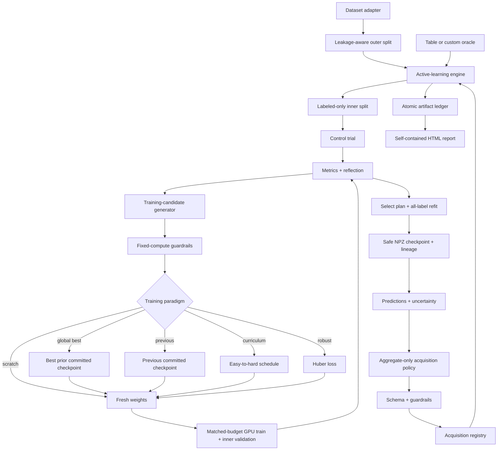

# Architecture

Agentic Active AutoResearch is a protocol-first modular monolith. It keeps one inspectable process for local
research while making datasets, surrogates, acquisition components, policies, and oracles
replaceable at stable boundaries.

## Component contracts

| Boundary | Built in | Extension mechanism |
|---|---|---|
| Dataset | synthetic, CSV, JSONL, optional Parquet | `register_dataset()` trusted loader |
| Featurizer | tabular, Morgan | implement `fit_transform` / `transform` |
| Surrogate | GPU PyTorch MLP, Chemprop v2, RF baseline | `register_model()` |
| Training candidate generator | sequential rule-based, OpenAI-compatible | `register_training_candidate_generator()` |
| Acquisition | uncertainty, diversity, random, target, representativeness, group/scaffold coverage | `register_acquisition()` |
| Policy | deterministic rule, OpenAI-compatible | implement `Policy.propose()` |
| Oracle | table reveal, callable | implement idempotent `Oracle.observe()` |

## Non-functional requirements

- Formal configs must use CUDA or Apple MPS and fail if no accelerator is available.
- The CPU RF path is a baseline/CI smoke path and is labeled as such in artifacts.
- Identical config, dataset, and seed produce identical splits and deterministic tie-breaking.
- Training candidates are selected on a labeled-only, group-aware inner split; outer validation is
  reporting-only.
- Trial count, epochs, architecture, ensemble size, MC passes, and label budget are fixed outside
  the candidate generator.
- Curriculum, robust loss, scratch, global-best continuation, and previous-round continuation use
  the same current-fit optimizer-step contract; inherited lineage is reported separately.
- Only current-run, committed, SHA-256-verified, non-pickle checkpoints can initialize built-in
  continuation candidates; global-best selection uses labeled-only inner metrics.
- External policies receive labeled-only aggregates, never outer-validation metrics, dataset rows,
  SMILES, targets, or credentials.
- A fully unlabeled regression pool requires an explicit oracle and separate disjoint labeled
  validation DataFrame; the table-oracle benchmark path remains the CLI default.
- Every selection is traceable to predictions, component scores, guarded weights, and observations.
- A failed or malformed LLM response falls back to the deterministic policy when enabled.
- Run files use atomic replacement; resume is refused when config, data, built-in source, or the
  external provider/model runtime contract changes.
- The observation ledger and summary are durable before state advances; a missing commit marker can
  be reconstructed only when all required round evidence is present.

## Failure modes

| Failure | Behavior |
|---|---|
| No CUDA/MPS under a formal config | fail before training; never silently use CPU |
| Missing RDKit/Chemprop | actionable optional-dependency error |
| LLM timeout, HTTP error, oversized response, invalid JSON | audited deterministic fallback |
| Candidate changes compute/architecture or exceeds bounds | drop/clip/repair with per-trial ledger |
| Inner split unavailable for a small/class-imbalanced set | one auditable all-label control fit |
| Partial inner run | reuse only completed matching plan hashes; otherwise retrain |
| Missing/corrupt/incompatible checkpoint | fail that candidate or refuse resume; never load pickle |
| Unknown acquisition key or invalid weight | drop/clip/renormalize with repair ledger |
| Duplicate IDs, target leakage, missing values | dataset validation fails before a run starts |
| Dataset/config changes during resume | hash mismatch stops the run |
| Custom oracle partial response | ID mismatch stops the round |
