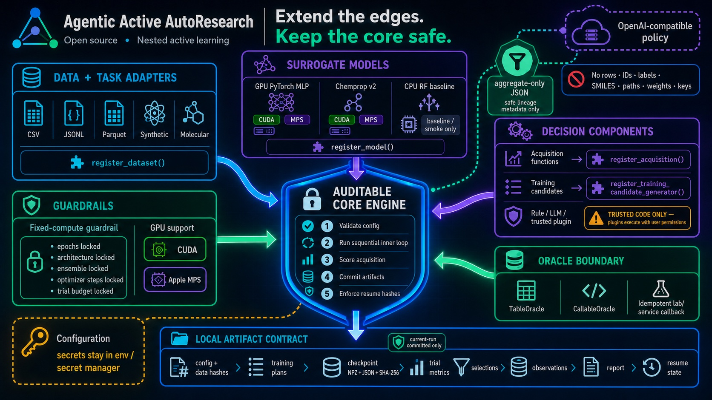

# Custom components



## Acquisition function

An acquisition function receives `AcquisitionContext` and returns one finite score per pool row.

```python
import numpy as np
from agentic_al import register_acquisition


def center_seeking(context, config):
    center = context.pool_features.mean(axis=0)
    distance = np.linalg.norm(context.pool_features - center, axis=1)
    return 1.0 / (1.0 + distance)


register_acquisition("center_seeking", center_seeking)
```

Add `center_seeking` to `acquisition.weights`, then load the trusted module with `--plugin`.

## Model

Register a factory that accepts `config`, `task`, `feature_columns`, and `seed`. The returned
object implements `fit`, `predict`, `featurize`, and `metadata`. `Prediction.uncertainty` must be a
one-dimensional, finite, non-negative array aligned with the input rows. Prediction means must be
finite and aligned; classification labels/probabilities/classes must satisfy their shared shape and
probability-mass contract. The engine validates these values before acquisition.

## Policy

Pass an object implementing `propose(PolicyContext) -> StrategyProposal` directly to
`run_experiment`. Policies do not choose IDs; the engine always validates weights, calculates
scores, and performs deterministic selection.

## Training-candidate generator

Register a factory whose object implements
`propose(TrainingCandidateContext, count) -> list[TrainingCandidate]`. The context contains only
aggregate completed-trial evidence, supported paradigm names, and declared numeric bounds. The
engine still drops forbidden parameters, clips values, removes duplicate plans, trains candidates,
and selects/refits the best one.

```python
from agentic_al import register_training_candidate_generator
from agentic_al.types import TrainingCandidate


class LowerLearningRate:
    def propose(self, context, count):
        value = context.base_parameters["learning_rate"] * 0.7
        return [
            TrainingCandidate(
                name=f"lower_lr_step_{context.inner_step_index}",
                parameters={"learning_rate": value},
                rationale="Conservative scratch retrain.",
                source="my_lab",
            )
        ][:count]


register_training_candidate_generator("lower_lr", lambda config: LowerLearningRate())
```

See `examples/custom_training_candidates.py` and [the inner-loop guide](inner-loop.md). The built-in
PyTorch backend exposes scratch, global-best/previous-round continuation, curriculum, and robust
training as locally validated enum values. A generator selects those paradigms but cannot provide
a checkpoint path. Third-party model backends remain scratch-only until a public safe-checkpoint
extension protocol is introduced.

From the repository root, validate and run the complete GPU example with:

```bash
agentic-autoresearch validate-config \
  --config configs/custom_training_candidates_gpu.yaml \
  --plugin examples/custom_training_candidates.py
agentic-autoresearch run \
  --config configs/custom_training_candidates_gpu.yaml \
  --plugin examples/custom_training_candidates.py
```

The plugin file is imported only because it is named explicitly. Installed packages may instead
use an importable module name such as `my_lab.agentic_al_plugin`. The resulting `candidate_batch.json`
and `trial_result.json` records identify `custom_conservative` as the proposal source; if the
plugin returns no distinct valid plan, the artifact ledger records any local fallback.

## Trust

Plugins are normal Python imports and execute with the user's permissions. Review source and pin
versions. Never allow a prompt, uploaded dataset, or untrusted config to choose a plugin module.
