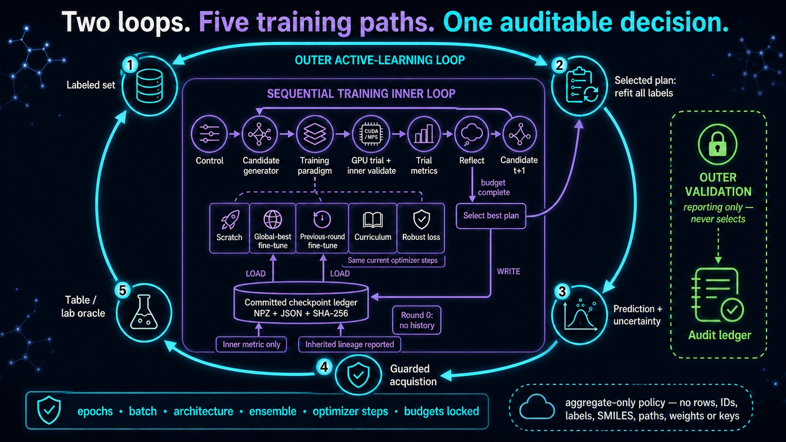
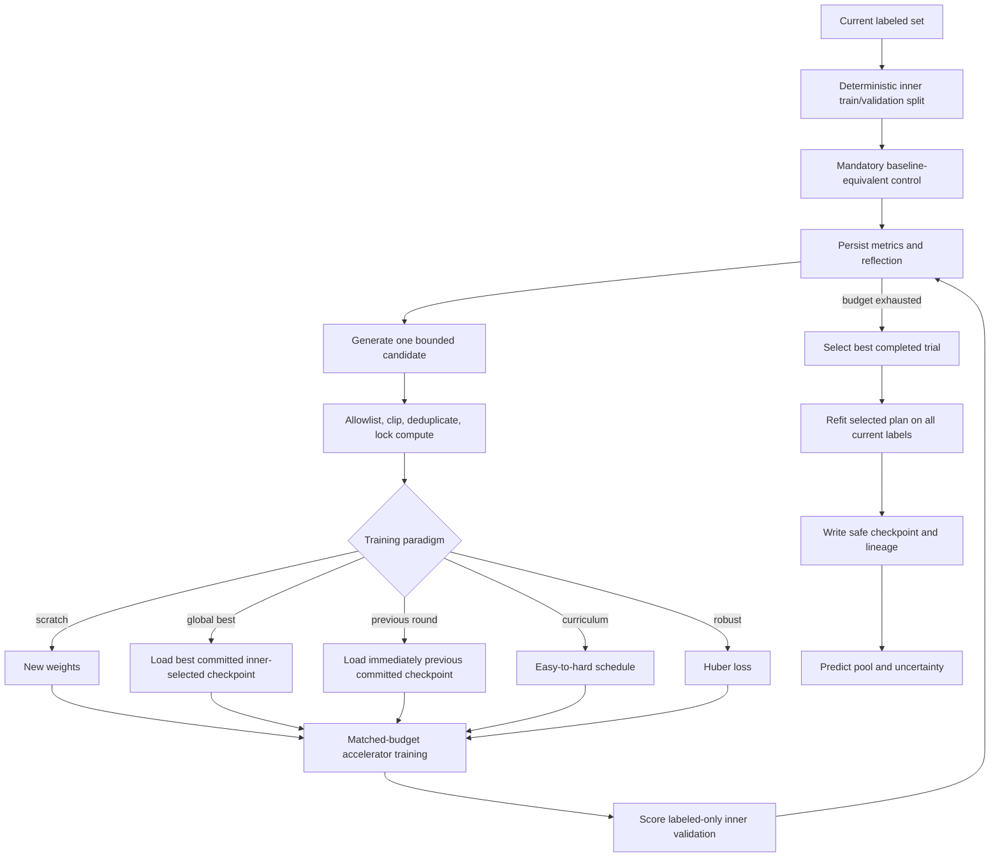

# Training-candidate inner loop

The inner loop is executable method logic, not a decorative hyperparameter sweep. At each outer
active-learning round, it uses only labels available at that time, evaluates sequential training
plans on a labeled-only inner split, selects one plan, and refits it on all current labels before
the pool is scored.



## Exact execution flow



The default `candidates_per_step: 1` means candidate N+1 can use candidate N's completed metrics.
Built-in generation prioritizes every available paradigm before scalar hyperparameter refinement,
so a six-trial regression budget covers the control plus the five core strategies once historical
checkpoints exist.

## Implemented paradigms

| Paradigm | What actually runs | Availability |
|---|---|---|
| `baseline_equivalent_control` | configured model, unchanged | mandatory when `require_control=true` |
| `retrain_from_scratch` | fresh initialization plus bounded tunable changes | all backends |
| `finetune_global_best` | continue the best prior committed checkpoint by compatible inner metric | built-in `torch_mlp`, round 1 onward |
| `finetune_previous_round` | continue the immediately previous committed active-round checkpoint | built-in `torch_mlp`, round 1 onward |
| `curriculum_training` | deterministic easy-to-hard sample access with fixed optimizer steps | built-in `torch_mlp`, regression and classification |
| `robust_loss_training` | replace regression MSE with Huber/SmoothL1 | built-in `torch_mlp`, regression only |

Round zero cannot expose either fine-tuning paradigm because no committed historical model exists.
Chemprop, random forest, and third-party models expose only paradigms they implement; unsupported
choices are never simulated.

### Global-best and previous-round continuation

Only checkpoints created by the current run's completed active rounds are eligible. `global_best`
uses the configured labeled-only inner metric and direction. It never reads outer-validation
metrics. `previous_round` resolves to the checkpoint under `round_(N-1)` after its commit marker and
required evidence are present.

The built-in checkpoint format is a compressed NumPy NPZ loaded with `allow_pickle=False`, plus a
JSON manifest. Before use, the loader verifies schema, adjacent filename, byte/array bounds,
SHA-256, keys, shapes, dtypes, task, classes, feature transform, architecture, output dimension,
and ensemble size. Fine-tuning freezes the originating feature transform and target normalization,
so copied weights retain a coherent coordinate system. An incompatible checkpoint fails closed as
an audited candidate; scratch remains the mandatory fallback.

Every warm-start model reports `lineage_training_fits`. Equal per-trial epochs and optimizer steps
do not erase the inherited historical compute advantage, so benchmark reports must show both the
matched current-fit budget and cumulative lineage.

### Curriculum and robust training

Regression curriculum difficulty is distance from the training-feature centroid. Classification
uses distance from each training class centroid and interleaves classes. The accessible subset
expands from 35% to 100% across epochs. Early subsets are deterministically resampled to the full
training-set length, keeping the same number of batches and optimizer steps as the control.

Robust training uses PyTorch `SmoothL1Loss(beta=1.0)`. It keeps the same architecture, feature
space, split, accelerator, epochs, batch size, ensemble size, and label budget as the control.

## Locked and tunable fields

Only numeric names in `inner_loop.tunable_parameters` that already exist in `model.parameters` can
change. Built-in GPU recipes expose learning rate, dropout, and weight decay. These remain locked:

- epochs, batch size, trial/round/label budgets;
- architecture, depth, width, hidden dimensions, and layer count;
- ensemble size, MC-dropout passes, workers, and device requirement;
- dataset, split, task, oracle, checkpoint path, and checkpoint source resolution.

Unknown or nonnumeric values are dropped, values are clipped to declared bounds, unchanged plans
are removed, and duplicates do not consume another generated slot. Every repair is persisted.

## Leakage-safe selection

Regression defaults to minimum inner MAE; classification defaults to maximum inner balanced
accuracy. Outer validation is evaluated only after all-label refitting and is absent from candidate
and checkpoint selection. When `dataset.group_column` is configured, the inner split is group
disjoint. If a valid labeled-only split cannot be constructed, the engine records the reason and
runs one all-label control instead of selecting on the outer set.

A single inner holdout is a compute-conscious default, not an unbiased guarantee. Publication
claims should use multiple seeds and a stronger nested or external evaluation protocol.

## Configuration

```yaml
inner_loop:
  enabled: true
  candidate_generator: rule_based
  trial_budget: 6
  candidates_per_step: 1
  validation_fraction: 0.25
  min_labeled_size: 24
  selection_metric: mae
  selection_mode: min
  require_control: true
  reuse_completed_trials: true
  candidate_paradigms:
    - retrain_from_scratch
    - finetune_global_best
    - finetune_previous_round
    - curriculum_training
    - robust_loss_training
  tunable_parameters:
    learning_rate: [0.00001, 0.005]
    dropout: [0.0, 0.5]
    weight_decay: [0.0, 0.01]
```

`trial_budget: 6` means at most six inner fits, including the control, followed by one selected-plan
all-label refit: at most 7 current fits. If distinct proposals are exhausted, the summary reports
unfilled slots instead of inventing duplicates.

## Candidate generators and privacy

- `rule_based`: deterministic local paradigms and bounded sequential refinement.
- `openai_compatible`: strict JSON proposals, the same local validation, and optional local
  fallback.
- custom plugin: a reviewed object implementing `propose(context, count)`.

```python
from agentic_al import register_training_candidate_generator
from agentic_al.types import TrainingCandidate


class MyGenerator:
    def propose(self, context, count):
        return [
            TrainingCandidate(
                name="lower_lr",
                parameters={"learning_rate": context.base_parameters["learning_rate"] * 0.7},
                paradigm="retrain_from_scratch",
                rationale="Conservative step based on completed aggregate metrics.",
                source="my_lab",
            )
        ][:count]


register_training_candidate_generator("my_generator", lambda config: MyGenerator())
```

An external provider receives only phase/round indices, labeled-set size, bounded parameter names,
supported paradigms, aggregate trial metrics, and safe checkpoint descriptors (source, origin,
inner metric/value, digest, lineage count). It never receives rows, IDs, labels, SMILES, paths,
weights, credentials, source code, or outer-validation data.

## Artifact and resume contract

```text
inner_loop/
├── inner_loop_config.json
├── split_summary.json
├── summary.csv
├── best_trial.json
├── inner_loop_summary.json
├── selected_checkpoint.json    # built-in torch_mlp only
├── selected_checkpoint.npz     # non-pickle arrays
└── step_000/
    ├── agent_context.json       # absent for mandatory control
    ├── candidate_batch.json
    ├── reflection.json
    └── trial_000/
        ├── training_plan.json
        └── trial_result.json
```

Trial reuse requires an identical plan hash covering model contract, initialization lineage, seed,
metric, code fingerprint, and hashed inner data/targets. Resume requires all committed evidence;
checkpoint corruption or removal stops a `torch_mlp` resume instead of silently retraining a
different lineage. See [ADR-0006](adr/0006-safe-checkpoint-lineage-and-training-paradigms.md).
